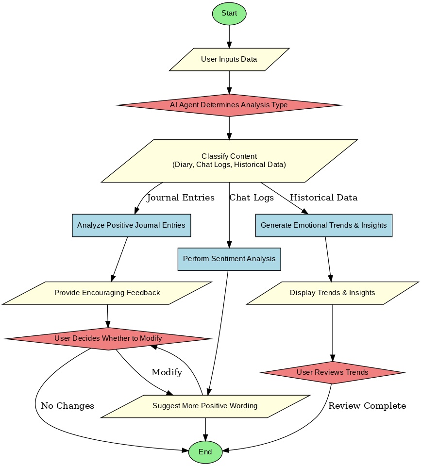

# DS Homework 1

# 113-2 師大資料結構 HW1
- 授課教師：蔡芸琤老師
- 姓名：陳生好
- 系級：科技系116

This repository contains my work for the Data Structure Homework 1 project. The goal of the project is to analyze and process data using Python. The repository includes the following files:

## Files in this Repository
- `main.py`: Main script that processes the data.
- `requirements.txt`: Contains a list of dependencies required to run the project.
- `crypto_data.csv`: A CSV file containing cryptocurrency data used for analysis.
- `all_conversation_log.csv`: A CSV file containing conversation logs.
- `project_flowchart.png`: A flowchart that visually represents the structure and process of the project.
- `.gitignore`: Specifies files and directories that should be ignored by Git.

## Project Flowchart

Below is a flowchart that illustrates the process flow of this project:



### Explanation

The flowchart represents the overall structure of the project:

1. **Data Input**: The project begins by loading data from `crypto_data.csv` and `all_conversation_log.csv`.
2. **Data Processing**: The script processes the input data, cleaning and structuring it for analysis.
3. **Data Analysis**: The processed data is analyzed using Python, applying various techniques such as filtering, aggregation, and statistical computations.
4. **Results & Output**: The final output includes insights derived from the data, which are either displayed in the console or saved into files.

This structured flow ensures that data is efficiently handled and meaningful insights are extracted.

## Instructions
To run the project:
1. Clone this repository.
   ```bash
   git clone https://github.com/mavericksoebroto/maverick_DS_Homework_1.git
   cd maverick_DS_Homework_1
2. Ensure you have **Python 3** installed. If not, download and install it from [Python Official Website](https://www.python.org/).
3. Install the dependencies by running: 
   ```bash
   pip install -r requirements.txt
4. Verify that the required data files (`crypto_data.csv` and `all_conversation_log.csv`) exist in the repository. If missing, download or generate them as needed.
5. Run the main script:
   ```bash
   python main.py
